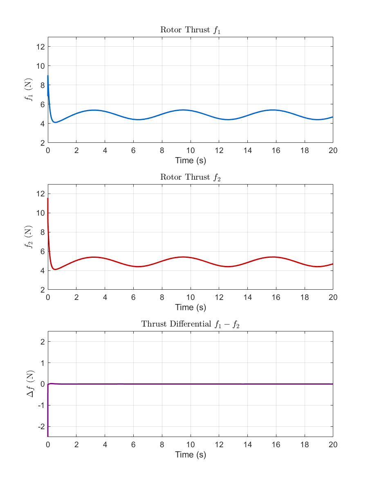

## 项目概述
本项目实现了一个三自由度(3DOF)四旋翼飞行器的控制仿真，包含：
- ​**​Simulink模型​**​ (`quadrotor_3dof_fas1.slx`)：实现飞行动力学模型和控制器
- ​**​MATLAB分析脚本​**​ (`init.m`)：自动生成状态跟踪、误差分析、轨迹对比和推力曲线
- ​**​鲁棒补偿对比​**​：验证鲁棒控制器对系统稳定性的提升效果

## 文件结构
├── quadrrotor_3dof_fas1.slx - Simulink主模型（含鲁棒补偿器）
├── init.m - 主分析脚本（自动绘图与Lyapunov稳定性分析）
├── magnify.m - 局部放大工具（用于误差分析图）
└── README.md - 项目说明文档

如果无法直接运行，可以先运行quadrotor_3dof_fas1.slx再注释掉sim("quadrotor_3dof_fas1.slx")再重新运行
## 三自由度无人机平面图

## 跟踪误差

## 状态图像

## 轨迹显示

## 输入曲线

